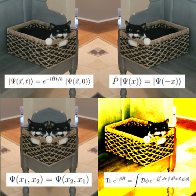

  
### **Roy Kim**  
Physics @ University of Texas at Austin   
Email: roy (dot) kim (at) utexas (dot) edu  
[LinkedIn](https://www.linkedin.com/in/kimmy2005/)

Welcome! I am an undergraduate Physics major at UT Austin.

My goal is to pursue a PhD in Physics, contributing to the application of physics in interdisciplinary fields. I am also involved in small-scale space systems research, particularly a 3U CubeSat project focusing on physics-oriented applications.

In my free time, I play guitar, train MMA, lift weights, and solve Rubik's cubes (my favorite finite non-abelian structures).

I'm a follower of Jesus Christ. If you’re interested, you can read testimonies from university faculty members [here](https://meettheprof.com/).

  
