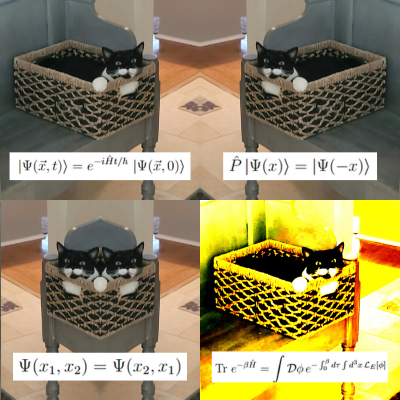

  
### **Roy Kim**  
Physics @ University of Texas at Austin   
Email: roy (dot) kim (at) utexas (dot) edu  
[LinkedIn](https://www.linkedin.com/in/kimmy2005/)

Welcome! I am an undergraduate physics major at UT Austin.

I'm interested in the intersection of theoretical physics and engineering applications.

Outside of academics, I enjoy playing guitar, training MMA, lifting weights, making coffee, and solving Rubik's cubes (my favorite finite non-abelian structures).

I'm a follower of Jesus Christ. If you’re interested, you can read testimonies from university faculty members [here](https://meettheprof.com/).

  
